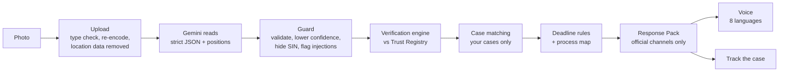

# Enveloppe

**Photograph a government letter. Enveloppe tells you what it is, whether it checks out, what to do and by when, in
your language, and tracks it until it's done.**

**Live: [enveloppe.photo](https://enveloppe.photo)** · Try it without signing in: [enveloppe.photo/demo](https://enveloppe.photo/demo) ·
Sign in: [enveloppe.photo/app](https://enveloppe.photo/app)

Every year, people in Canada get letters from CRA and IRCC that are hard to read, have strict deadlines, and are copied
by scammers. Enveloppe is built for newcomers, seniors and anyone who has stared at one of those letters.

> **The AI reads. The code decides.** Gemini turns the photo into structured data. Whether the letter checks out, the
> deadline, the next steps and which case it belongs to are decided by deterministic code, against official sources
> that every result cites.

## What it does

- **Reads** a phone photo of a letter from CRA, IRCC, ServiceOntario or the City of Ottawa.
- **Checks** every phone number, link, QR code, payment demand and form against a curated **Trust Registry** of official
  facts. Each check links to the canada.ca page it's based on and the date it was verified.
- **Catches scams in context:** a letter that claims to belong to your existing case but contradicts it, and official
  sources, is flagged as a likely imitation.
- **Computes the legal deadline** from the rule, not just the printed date, and shows both side by side.
- **Places the letter in the government process** ("You are here") and says what usually happens next.
- **Gives next steps** using only official channels, contacts and forms, never anything printed on the letter.
- **Explains it aloud** in 8 languages (English, French, Arabic, Chinese, Spanish, Tagalog, Ukrainian, Hindi).
- **Tracks the case:** proof of submission, status, next deadline and history. Old letters are flagged as old instead
  of being treated as current.

## Try the demo

Sign in at [enveloppe.photo/app](https://enveloppe.photo/app) and upload the synthetic sample letters from
[`demo/letters/out/`](demo/letters/out):

| # | Do this | What Enveloppe shows |
|---|---|---|
| 1 | Upload `A_cra_ccb_review.png` | **Matches trusted sources**; the printed and calculated deadlines; "You are here"; the documents to send. Click **Track it as a case** |
| 2 | Upload `B_cra_twin_scam.png` | **Contradictions found**: a fake phone number, a QR code to a lookalike site, and pressure to pay by e-Transfer. It also clashes with your case. Click **Keep it separate** |
| 3 | On letter B, **Listen in my language** → Arabic | A spoken explanation built from the checked facts, pointing only to CRA's real number |
| 4 | Open the case, click **I've submitted it** | The case moves to **Waiting for CRA** |
| 5 | Upload `G_cra_review_outcome.png` | Filed in the same case automatically (same reference number); the case closes at **Outcome received** |

Also try `C` (a reassessment with a statutory objection deadline), `D` (IRCC biometrics, the 30-day rule), `E` (a blurry
photo, which asks you to confirm details) and `F` (instructions to the AI hidden in the letter: flagged, never obeyed).
No account? [enveloppe.photo/demo](https://enveloppe.photo/demo) walks through the same letters read-only.

## How it works



| Stage | What happens | Code |
|---|---|---|
| Upload | Photos up to 8 MB; file type checked by content; re-encoded (fixes rotation, strips EXIF/GPS); stored privately; deleted after 30 days | `lib/upload/`, `lib/api/` |
| Read | Gemini 3.8 Flash (3.5 Flash fallback) returns ~20 kinds of detail in a format derived from our Zod contracts, each with its position on the page | `lib/gemini/` |
| Guard | Output validated; confidence can only go down; social insurance numbers redacted; text addressed to software captured as evidence, never obeyed | `lib/gemini/guard.ts` |
| Verify | Phones, links and emails, QR codes (decoded on our server, never opened), payment methods, forms and threat wording checked against the registry → a four-level verdict | `lib/verification/`, `lib/url/`, `lib/qr/`, `data/registry/` |
| Match | The letter is compared with the user's own cases by points and clash rules | `lib/cases/threading.ts` |
| Deadline and process | Rules as code, holidays calculated, printed vs calculated dates; ordered process maps | `lib/deadlines/`, `lib/processes/`, `data/processes/` |
| Next steps | A templated Response Pack from registry contacts, channels and forms | `lib/cases/response-pack.ts` |
| Voice | Script built from the verified result → Gemini translation with locked placeholders → dates and numbers formatted by code → scrubbed → ElevenLabs → cached | `lib/voice/` |

**The verdict** has four levels and no score. *Contradictions found* means any hard contradiction.
*Matches trusted sources* requires at least two strong matches, a fully readable letter, every contact detail checked,
no hidden instructions and no clash with your case. Otherwise it's *partially verified* or *can't verify*. It never
says "legitimate" or "scam".

**Case matching** gives a case points for what it shares with the letter: reference number +100, program +30, a fitting
next step in the process +25, same year +20, same agency +10, dated later +5, and −30 for letters dated over a year
before the case began. A letter **merges automatically only at 100+ with an exact reference match and no clashes**. All
the other signals add up to 90, so nothing merges on similarity alone. From 40 points the user is asked; below that,
it's a new case. A scam twin is designed to look similar, which is why similarity is never enough.

## Why we built it this way

| Decision | Alternative we rejected | Why |
|---|---|---|
| AI extracts, code decides | Asking an LLM "is this a scam?" | An LLM can invent answers, varies between runs, can't reliably cite sources, and a letter can talk it into "legitimate". Rules are explainable, repeatable and testable |
| Gemini with an enforced JSON format | OCR plus pattern matching | Understands layout and meaning (issue date vs deadline) and survives glare and rotation; returns typed fields with positions and confidence |
| A curated registry with cited sources | Fetching canada.ca live, or the model's memory | No server-side fetching of untrusted URLs; no invented phone numbers; every fact dated, versioned in git and validated at startup |
| Deadlines as code | Trusting the printed date, or AI arithmetic | Printed dates can be missing, misread or fake; legal rules have subtleties (CRA objection: the later of 90 days or one year after the filing deadline) |
| Points and clash rules for case matching | Embedding similarity, or an LLM | Similarity would merge a scam twin into your case; rules are explainable and keep case history away from AI |
| Voice from verified facts | Reading the letter aloud, or an AI summary | Never speaks a scammer's number; dates can't be mistranslated; no personal data reaches the voice service |
| Auth0 with a server-side session | Tokens in the browser, or our own login | No tokens exposed to scripts; minimal profile (no email); no password storage to get wrong |
| One Vultr server in Toronto with Docker Compose | Serverless, or Kubernetes | Data stored in Canada; full control of HTTPS, headers and database isolation; reproducible with one command |
| PostgreSQL with Drizzle (PGlite locally) | SQLite, Firebase, MongoDB | The same database engine in development, tests and production; relational ownership; type-checked, parameterized queries |

## Built with

- **Google Gemini**: multimodal reading of letter photos into a strict, validated format, including where each detail
  appears on the page; also translation of the spoken explanation, with dates and numbers locked.
- **Auth0**: sign-in with PKCE and an encrypted server-side session; `openid profile` only; the token endpoint is
  disabled, so no tokens ever reach the browser. Identity drives per-user data isolation, which the case history and
  scam-in-context detection depend on.
- **ElevenLabs**: "Listen in my language" in 8 languages with one multilingual voice; receives only scrubbed text built
  from verified facts; the key can only do text-to-speech; clips are cached.
- **Vultr**: production in Toronto: the Next.js app (standalone, non-root), PostgreSQL with no public port, and Caddy
  for automatic HTTPS, behind a firewall with key-only SSH.
- Next.js 16 (App Router), TypeScript (strict), Tailwind CSS, Zod, Drizzle ORM, PostgreSQL / PGlite, sharp, jsQR,
  libphonenumber-js, tldts, Vitest, Playwright. The domain is registered with Porkbun.

## Security and privacy

- **Identity:** Auth0 session in an encrypted HttpOnly cookie; the server never trusts a user id from the request.
- **Isolation:** every query is scoped to the signed-in user; another user's letter or case returns 404.
- **Requests:** state-changing requests must come from our own origin; strict input validation; per-user rate limits.
- **Minimal data:** reference numbers are stored only as a keyed fingerprint plus the last 4 digits; SINs are
  redacted; no emails are stored; photos expire after 30 days and can be deleted.
- **Third parties:** Gemini receives the image with a fixed prompt, on a paid tier whose inputs aren't used for product
  improvement. ElevenLabs receives scrubbed text only. During the hackathon, only synthetic letters are used.
- **Browser:** a nonce-based Content Security Policy, HSTS, frame blocking; React escaping only.
- **Logs:** request ids, routes, status and timings only; never letter content.

Full control-by-control review, with evidence and residual risks: [`docs/SECURITY_REVIEW.md`](docs/SECURITY_REVIEW.md).

## Testing

| Suite | Command | What it covers |
|---|---|---|
| Unit and integration (Vitest, 239 tests, real Postgres in memory) | `npm run check` (also type-check, lint and production build) | Reading guard, registry integrity, every verification check, case matching, deadlines, processes, per-user isolation, API rules (auth, same-origin, validation, rate limits, EXIF removal, expiry), voice safety, pages and components |
| Browser (Playwright, desktop and mobile) | `npm run test:e2e` | The demo walkthrough, security headers and CSP, sign-in redirect and cookie flags, protected routes, clickable affordances. The signed-in flow runs when `E2E_USER` / `E2E_PASSWORD` are set |
| Demo rehearsal (live Gemini and ElevenLabs) | `npm run demo:rehearse -- --runs 3` | The full story through the real API: A → B → Arabic voice → proof → G closes the case, with timings (about 6 s per letter) |
| Live contract tests | `npm run test:live` | Gemini's reading of the sample letters against their ground truth; voice |

Against the live site: `E2E_BASE_URL=https://enveloppe.photo npx playwright test`.

## Run it locally

```bash
npm install
cp .env.example .env.local   # fill in the values below
npm run dev                  # http://localhost:3000
```

| Variable | Notes |
|---|---|
| `APP_BASE_URL` | `http://localhost:3000` locally |
| `DATABASE_URL` | `pglite:./.data/enveloppe` (Postgres in-process, no Docker), or a `postgres://` URL |
| `REF_HMAC_KEY` | 32+ random bytes, hex. Keep it stable: it's how reference numbers are matched |
| `GEMINI_API_KEY`, `GEMINI_MODEL`, `GEMINI_FALLBACK_MODEL` | e.g. `gemini-3.8-flash` and `gemini-3.5-flash` |
| `AUTH0_DOMAIN`, `AUTH0_CLIENT_ID`, `AUTH0_CLIENT_SECRET`, `AUTH0_SECRET` | A Regular Web Application. Allow callback `http://localhost:3000/auth/callback`, logout and web origin `http://localhost:3000` |
| `ELEVENLABS_API_KEY`, `ELEVENLABS_VOICE_ID`, `ELEVENLABS_MODEL_ID` | Optional: without them, explanations are text only |
| `DEMO_MODE` | `off`, `fallback` (saved readings of the sample letters if Gemini fails, always labelled "Cached reading") or `offline` |

Migrations in `db/migrations` apply automatically on first connection. One local database folder can only be used by
one process at a time: stop `npm run dev` before running scripts that use it, such as `demo:reset`.

| Script | Purpose |
|---|---|
| `npm run check` | Type-check, lint, unit tests, production build |
| `npm run test:e2e` | Production build + browser tests |
| `npm run demo:letters` | Render the synthetic sample letters to `demo/letters/out/` |
| `npm run demo:build` | Rebuild the public `/demo` data and the saved readings |
| `npm run demo:rehearse -- --runs 3` | Rehearse the full demo through the API (`--offline`, `--no-voice` available) |
| `npm run demo:reset -- --sub "auth0\|…"` | Reset a demo account and seed an existing case (CLI only; there's no reset endpoint) |
| `npm run extract -- <image>` | Read one letter with Gemini and print the result |

## Deploy

Production runs at **[enveloppe.photo](https://enveloppe.photo)** on a Vultr server in Toronto with Docker Compose:
the Next.js app, PostgreSQL (not exposed) and Caddy (automatic HTTPS). Step-by-step guide, including DNS, Auth0
production URLs, backups and key rotation: [`docs/DEPLOY.md`](docs/DEPLOY.md). To ship an update:
`git pull && dc up -d --build` on the server.

## API

Every route requires sign-in; requests that change data must also come from our own origin.

| Route | What |
|---|---|
| `POST /api/letters` | Upload a photo (multipart field `file`, ≤ 8 MB): sanitized, stored privately, de-duplicated |
| `POST /api/letters/:id/analyze` | Reading → QR → verification → case matching → deadline → Response Pack. Idempotent |
| `GET /api/letters/:id` | Status, plus the full result once analyzed |
| `GET /api/letters/:id/image` | The sanitized photo (owner only, `no-store`) |
| `POST /api/letters/:id/confirm` | Correct unclear fields; re-runs the checks without the model |
| `POST /api/letters/:id/case` | Answer "same case?": `link`, `new` or `keep_separate` |
| `POST /api/letters/:id/unlink` · `DELETE /api/letters/:id` | Undo a link · delete a letter |
| `GET /api/inbox` · `GET` / `DELETE /api/cases/:id` | Civic Inbox · case detail · delete a case |
| `POST /api/tasks/:id/complete` | Save proof of submission; the case moves forward |
| `POST /api/letters/:id/speech` · `GET …/speech?lang=` | Build, translate and voice the explanation (cached) · the audio |

## Project layout

| Path | What |
|---|---|
| `app/` | Pages: home, `/demo` (public), `/app` (inbox, letter, case) and the API route handlers |
| `components/` | UI: letter view, verification list with highlights on the photo, deadline card, process stepper, Response Pack, voice |
| `lib/gemini/` | Letter reading: client, prompt, response schema, guard |
| `lib/verification/`, `lib/url/`, `lib/qr/`, `lib/phone.ts` | Verification engine and verdict; link analysis; QR decoding; phone numbers |
| `data/registry/` + `lib/registry/` | Trust Registry facts (JSON, each citing its source) + loader, integrity checks and lookups |
| `lib/cases/` | Case matching, result assembly, Response Pack, case service |
| `lib/deadlines/`, `lib/processes/` + `data/processes/` | Deadline rules, holidays, old-letter detection; process maps |
| `lib/voice/` | Spoken explanation: script, translation, ElevenLabs, cache |
| `lib/auth/`, `proxy.ts` | Auth0 session, `requireUser()`, route protection, security headers and CSP |
| `lib/db/`, `db/migrations/` | Drizzle schema, Postgres/PGlite client, user-scoped repository |
| `lib/api/`, `lib/pipeline/`, `lib/upload/` | Route logic, the analysis pipeline, upload sanitizing |
| `lib/contracts/` | Shared Zod schemas and types at every boundary |
| `demo/` | Synthetic letters (specs and renders), fixtures, saved readings for the demo |
| `tests/` | `unit/` (Vitest), `e2e/` (Playwright), `live/` (real APIs) |
| `Dockerfile`, `docker-compose.prod.yml`, `Caddyfile` | Production build and deployment |

More: the full plan in [`docs/BLUEPRINT.md`](docs/BLUEPRINT.md) and the engineering rules in [`CLAUDE.md`](CLAUDE.md).

## Scope and known limits

- The Trust Registry covers CRA, IRCC, ServiceOntario and the City of Ottawa: 19 official sources, verified
  2026-09-26. The City of Ottawa entries still need a human check.
- Letter types outside our list (for example CRA's "notice of redetermination") are treated as "other" and don't move
  a case forward.
- Deadline rules are implemented from official sources but haven't been reviewed by a lawyer. Always confirm with the
  agency.
- Rate limits are in memory, which is fine for a single server; scaling out would need a shared store.

Enveloppe is not affiliated with the Government of Canada and isn't legal or tax advice. Every sample letter is
synthetic: no real person's data.

Built at Hack the Hill 2026.
